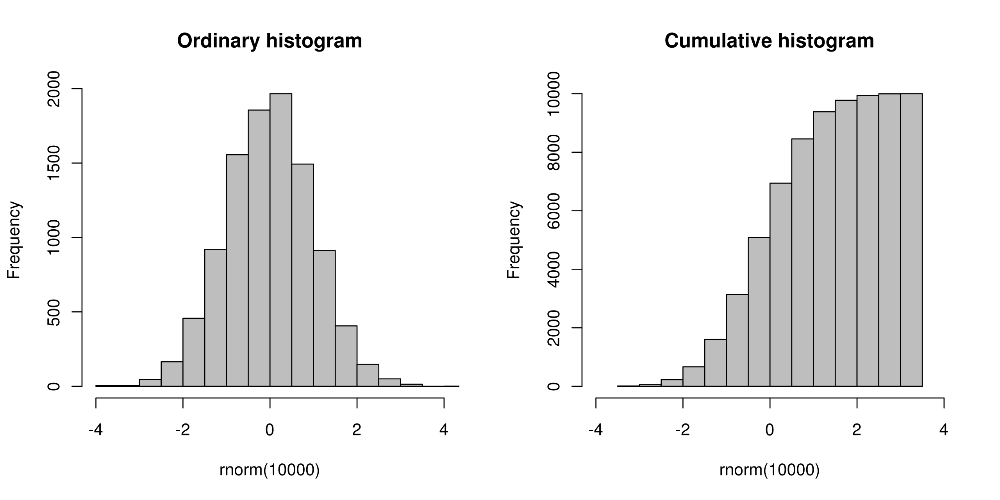
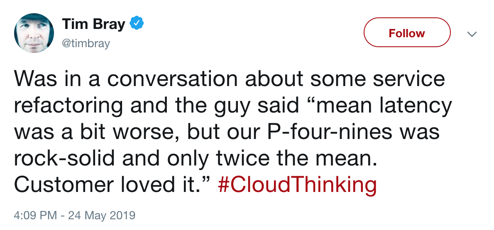
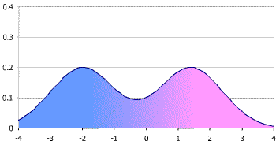
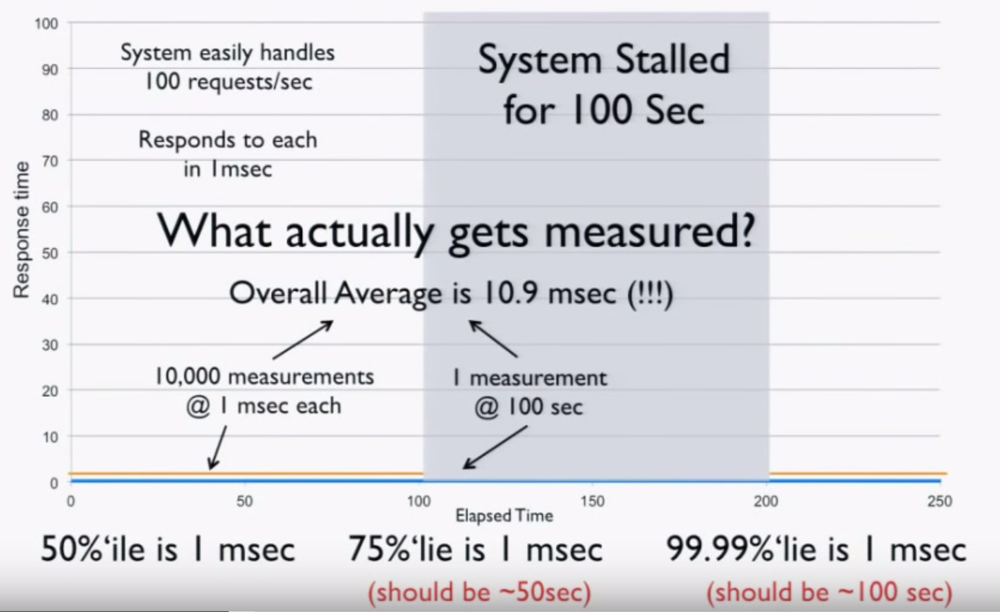
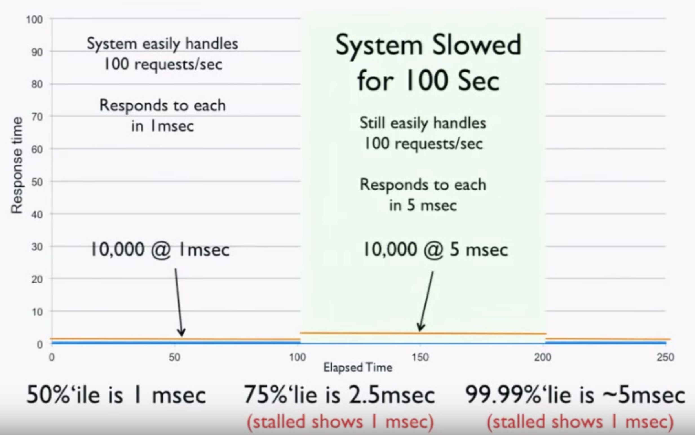

# Things you should know about latency

---

[.build-lists: true]

## What we will cover

- What is latency?
- Why is latency important?
- How can we improve latency?
- How should we measure latency?
- Demo of `wrk2`, `HdrHistogram`

---

# What is latency?

---

> The time delay between the cause and the effect of some physical change in the system being observed
> -- Wikipedia

---

## Components of latency

```
┌──────────────┐                      ┌──────────────┐
│              │                      │              │
│    Client    │◁══════Network══════▷│    Server    │
│              │                      │              │
└──────────────┘                      └──────────────┘
```

Latency vs throughput/bandwidth

---

## Tail latency



> [By Kierano - Own work, CC BY-SA 3.0](https://commons.wikimedia.org/w/index.php?curid=6428627)

---

# What is latency important?

---

[.autoscale: true]

[.build-lists: true]

## Why is low latency important?

- Studies by Walmart, Google, and Amazon strongly correlate page speed with conversion
- Games. 30ms will cause a perceived difference to players
- High Frequency Trades. [5 ms difference leads to a difference of \$4,000,000 revenue / millisecond!](http://www.tabbgroup.com/PublicationDetail.aspx?PublicationID=346)
- High latency affects overall scalability of systems
  - longer request queues, paging, retries, etc. Cascading effects can lead to catastrophic failure. Example: RR

---



Clearly, latency is important.

But why is p99 (or more) latency important? It affects only 1% of requests, so what's the big deal?

---

[.autoscale: true]

## Why is Tail Latency important?

**Latency is not normally distributed**



> [CC BY-SA 3.0](https://commons.wikimedia.org/w/index.php?curid=641362)

- Latency is usually multimodal. This may be due to downstream spikes, something about how your program fits into cache, how your DB is partitioned, an indication of some underlying infrastructure quirks etc
- It is useless to look at means or p50s, or even averages of p99s. You need to understand the behavioural characteristics of the latency in your system

---

## Why is Tail Latency important?

**Tail latency is the normal case!**

$$
(1-(.99 ^ n )) * 100%
$$

Where $$ n $$ is the number of actions subject to tail latency for an operation

---

## Why is Tail Latency important?

**Tail latency is the normal case!**

| Site                | # requests | Affected by tail latency |
| ------------------- | ---------- | ------------------------ |
| Walmart.ca PiP      | 86         | 57                       |
| Walmart.ca Homepage | 124        | 71                       |
| google.ca           | 23         | 20                       |

The 99th percentile is what our users will actually be affected by, not the 50th percentile! For sessions involving multiple pages, this number is even higher. Almost no one will experience the p50!

---

# How can we improve latency?

---

```
┌──────────────┐                      ┌──────────────┐
│              │                      │              │
│    Client    │◁══════Network══════▷│    Server    │
│              │                      │              │
└──────────────┘                      └──────────────┘
```

---

## Client latency

[.build-lists: true]

- Parallelization
- Optimization
- Deferrment
  - In React, `Suspense`!

---

## Network latency

[.build-lists: true]

- Speed of light. $$ 3 \times 10 ^8 m/s $$. 🤷‍♀️
- Datacenter locations. CDNs
- Streaming responses

---

[.autoscale: true]

[.build-lists: true]

## Server Latency

- Languages:
  - Fast execution
  - No GIL
  - No global GC spike. Pre-emptive scheduling
- Horizontal / Vertical scaling
  - Amdahl's law - fixed problem size
  - Gustafson's law - increasing problem size
- General Strategies:
  - Prioritize failing fast with retries over completeness of data
  - At the Google level of scale, they [evaluate disk vs flash](https://dl.acm.org/citation.cfm?id=2019527)
  - backpressure, exponential backoff etc

---

# How should we measure latency?

---

[.autoscale: true]

## We (mostly) measure tail latency wrong

### "Coordinated ommission" - Gil Tene

[.build-lists: true]

- Tools generate load at a precalculated rate, eg, 100 req/second
- If a request stalls for a long time, the tool will wait for the slow request, and then send subsequent requests
- The stall time does not count towards the response time of the subsequent requests!
- The system will appear to have better response times that it actually does!
- Internal benchmarks exhibit the same behaviour!

**Coordinated ommission shows service time, not response time**

---

## We (mostly) measure tail latency wrong

### Example



> ["How NOT to Measure Latency" by Gil Tene](https://youtu.be/lJ8ydIuPFeU)

---

## We (mostly) measure tail latency wrong

### It gets even worse



> ["How NOT to Measure Latency" by Gil Tene](https://youtu.be/lJ8ydIuPFeU)

---

## We (mostly) measure tail latency wrong

Self Measurement problem

---

## Service time vs response time

Coffee shop example

---

## Tools to measure latency correctly

- [wrk2](https://github.com/giltene/wrk2)
- [HdrHistogram](http://hdrhistogram.github.io/HdrHistogram/)
- Gatling

---

## To summarize

- What is latency?
- Why is latency important?
- How can we improve latency?
- How should we measure latency?

---

# Demo

---

# Appendix

---

## Appendix

### References

- [Amdahl's Law](https://en.wikipedia.org/wiki/Amdahl%27s_law)
- [Gustafson's law](https://en.wikipedia.org/wiki/Gustafson%27s_law)

---

[.autoscale: true]

## Appendix

### Articles & Papers

- ["How NOT to Measure Latency" by Gil Tene](https://youtu.be/lJ8ydIuPFeU)
- [@tacertain tweet about p99 latency](https://twitter.com/tacertain/status/1132391299733000193)
- [Warehouse-Scale Computing: Entering the Teenage Decade](https://dl.acm.org/citation.cfm?id=2019527)
- [You can learn a lot from a histogram](http://amistrongeryet.blogspot.com/2010/04/you-can-learn-lot-from-histogram.html)
- [You can't average percentiles. Period.](http://latencytipoftheday.blogspot.com/2014/06/latencytipoftheday-you-cant-average.html)

---

## Appendix

### Tools

- [HdrHistogram](http://hdrhistogram.org/)
- [wrk2](https://github.com/giltene/wrk2)
